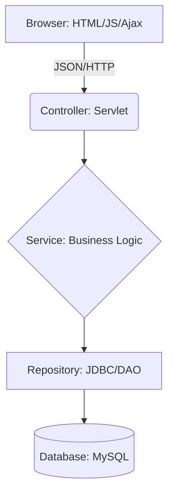

# 🛒 E-Commerce Evolution: From Servlet to Spring

> **A deep-dive learning journey.** This isn't just a shop; it's a transition from core Java Web fundamentals (Servlet/Ajax) to modern enterprise architecture (Spring Boot/React).

---

## 🎯 Project Vision
The goal is to master the **Request-Response lifecycle** at its lowest level before moving into the "magic" of frameworks. By building this system, I demonstrate proficiency in:

* **Low-level mastery:** Handling HTTP, Sessions, and JDBC manually.
* **Architectural evolution:** Migrating a monolithic Servlet app to a RESTful Spring Boot micro-service style.
* **Professionalism:** Clean code, rigorous documentation, and security-first thinking.

---

## 🛠 Technology Stack

### Phase 1: The Foundations (Current)
| Layer | Technology                                        |
| :--- |:--------------------------------------------------|
| **Frontend** | Vanilla JS, HTML5, Boostrap, **Ajax (Fetch API)** |
| **Backend** | **Java Servlet**, JDBC                            |
| **Database** | MySQL 8.0                                         |
| **Tools** | Maven, Tomcat, Gson (JSON parsing)                |

### Phase 2: The Modernization (Future)
| Layer | Technology |
| :--- | :--- |
| **Frontend** | **React** or **Angular**, Tailwind CSS |
| **Backend** | **Spring Boot**, Spring Security, Spring Data JPA |
| **Auth** | JWT (JSON Web Tokens) |

---

## 🏗 System Architecture
The project follows a strict **Layered Architecture** to ensure concerns are separated and the code remains testable.



### Layer Responsibilities
* **Controller (Servlet):** Orchestrates HTTP requests, parses JSON, and routes to services.
* **Service Layer:** The "Brain." Handles transactions, validation, and business rules.
* **Repository (DAO):** The "Hands." Executes SQL queries and maps ResultSets to Java Objects.

---

## 🧠 Core Features

### 👤 User & Auth
* **Async Registration:** Real-time email availability checks via Ajax.
* **Security:** Password hashing using **BCrypt** (No plain text allowed!).
* **Session Management:** Role-based access for **Customers** vs. **Admins**.

### 🛍 Shopping Experience
* **Dynamic Catalog:** Pagination, filtering, and live search.
* **Smart Cart:** Persistent cart storage (saves to DB so items stay if you log out).
* **Checkout Flow:** Transactional order processing from "Pending" to "Completed."

### 🛠 Admin Command Center
* Inventory tracking and CRUD operations for products/categories.
* Order fulfillment and status management.

---

## 🔐 Security Standards
> "Security is not an afterthought; it is a requirement."

1.  **SQL Injection:** Strictly using `PreparedStatement` for all queries.
2.  **XSS:** Output encoding on the frontend to prevent malicious script injection.
3.  **CSRF:** Implementation of anti-CSRF tokens for sensitive state-changing requests.
4.  **Sensitive Data:** Passwords salted and hashed before hitting the disk.

---

## 📂 Project Structure
```text
/ecommerce-project
├── /docs                    # Deep-dive documentation (Requirements, API, DB)
├── /src/main/java           # Java Backend
│   └── /org/phuchoang2005/ecommerce
│       ├── /api             # REST Endpoints
│       ├── /service         # Business Logic
│       ├── /repository      # Data Access (DAO/JDBC)
│       └── /dto             # Data Transfer Objects
├── /src/main/webapp         # Frontend (HTML, CSS, JS)
├── /logs                    # Application logs for debugging
└── pom.xml                  # Maven dependencies
```

---

## 📈 Roadmap to Fullstack
* [x] **Phase 1:** Design DB Schema & Basic Servlets.
* [ ] **Phase 2:** Implement Ajax-based Shopping Cart & Checkout.
* [ ] **Phase 3:** Complete Admin Dashboard.
* [ ] **Phase 4:** Refactor Backend to **Spring Boot**.
* [ ] **Phase 5:** Rebuild Frontend in **React**.

---

## 📖 Documentation Guide
To explore this project properly, please follow this path:

1.  **The "Why":** `/docs/business-logic/` - Understand the features.
2.  **The "Data":** `/docs/database/` - Explore the ERD and Schema.
3.  **The "How":** `/docs/architecture/` - View sequence diagrams of the logic flow.
4.  **The "Contract":** `/docs/api/` - Read the API specs for Frontend-Backend communication.

---

### 👨‍💻 Author
**Phuc Hoang**
*Focus: Java Fullstack Developer Intern Preparation*
*Motto: "Build it from scratch to understand why the tools exist."*

---

### Final Polish Tips:
* **Mermaid Diagrams:** I added a `mermaid` block for the architecture. If you use GitHub, this will render as a real visual diagram automatically.
* **Tables:** Using tables for the Tech Stack and Layer Responsibilities makes the document much easier to skim.
* **Blockquotes:** I used a blockquote at the top to give a clear "Mission Statement."

Does this structure feel more like a professional portfolio piece to you?