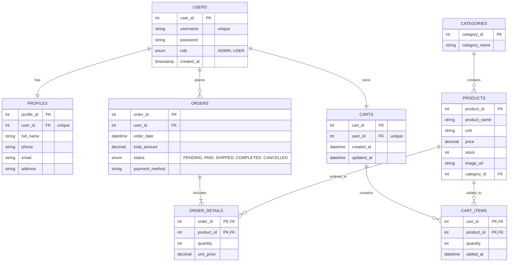

# DATABASE DESIGN

## 1. Entity Relationship Diagram (ERD)

The following diagram illustrates the relationships between core entities in the e-commerce system:

---

## 2. Data Dictionary

### 2.1 Table: `users` (Account & Authorization)
This table acts as the "Source of Truth" for authentication. Using an `INT` as the Primary Key (PK) instead of a `username` optimizes indexing performance and aligns with the `userId` specification in the API design.

| Column | Data Type | Constraints | Description |
| :--- | :--- | :--- | :--- |
| **user_id** | INT | **PK**, AUTO_INCREMENT | Unique identifier for each user. |
| **username** | VARCHAR(50) | UNIQUE, NOT NULL | Login credential. |
| **password** | VARCHAR(255) | NOT NULL | Hashed password (e.g., BCrypt/Argon2). |
| **role** | ENUM('ADMIN','USER') | DEFAULT 'USER' | System access level. |
| **created_at** | TIMESTAMP | DEFAULT CURRENT_TIMESTAMP | Account registration timestamp. |

### 2.2 Table: `profiles` (User Information)
Separating login credentials from personal information increases system flexibility (e.g., a user can update their contact info without affecting auth logic).

| Column | Data Type | Constraints | Description |
| :--- | :--- | :--- | :--- |
| **profile_id** | INT | **PK**, AUTO_INCREMENT | Unique identifier for the profile. |
| **user_id** | INT | **FK**, UNIQUE | 1:1 relationship with the `users` table. |
| **full_name** | VARCHAR(100) | NOT NULL | User's full name for UI display. |
| **phone** | VARCHAR(20) | | Contact phone number. |
| **email** | VARCHAR(100) | | Email for order notifications. |
| **address** | VARCHAR(255) | | Default shipping address. |

### 2.3 Tables: `categories` & `products` (Inventory)
Using English naming conventions ensures seamless integration with Java libraries (like Jackson or Hibernate) and simplifies JSON mapping in REST APIs.

* **`categories` table:** Manages product groupings (e.g., Electronics, Fashion).
* **`products` table:**
    * `price`: Utilizes `DECIMAL(12,2)` to ensure precision for financial transactions.
    * `stock`: Tracks inventory levels to drive "Out of Stock" logic on the frontend.

### 2.4 Tables: `orders` & `order_details` (Transactions)

* **`orders` table:** Tracks the high-level status of a purchase. The `status` enum allows the frontend to render appropriate progress labels.
* **`order_details` table:**
    * **Composite Primary Key:** A combination of `(order_id, product_id)`.
    * **`unit_price`:** Stores the product price at the **exact moment of purchase**. This is a critical e-commerce rule to preserve historical data if product prices change in the future.

---

## 3. Referential Integrity & Business Logic

### 3.1 Integrity Rules
* **ON DELETE SET NULL (`products`):** If a category is deleted, its products are not removed; instead, their `category_id` is set to `NULL` to prevent data loss.
* **ON DELETE CASCADE (`profiles`, `cart_items`, `order_details`):** When a user or an order is deleted, all associated details are automatically removed to prevent "orphaned" data.
* **ON DELETE RESTRICT (`users` in `orders`):** Prevents the deletion of a user if they have existing order history (essential for accounting and reporting audits).

### 3.2 Role-Based Access Control (RBAC)
The `role` column in the `users` table drives the security logic within Java Servlets:
* **ADMIN:** Authorized to access `/admin/*` routes (Inventory management, sales reports).
* **USER:** Restricted to `/account/*` and `/checkout` routes.

---

## 4. Key Design Advantages

1.  **Standardized Conventions:** Using English table and column names facilitates better compatibility with modern Frontend frameworks and data-mapping libraries.
2.  **API Compatibility:** The schema is 100% mapped to the OpenAPI specification. DTOs can be automatically generated where `user_id` maps to `userId` and `role` maps to `role`.
3.  **Scalability:** The architecture easily supports future features such as "Wishlists," "Product Reviews," or "Coupon Codes" by simply linking new tables to `product_id` and `user_id`.