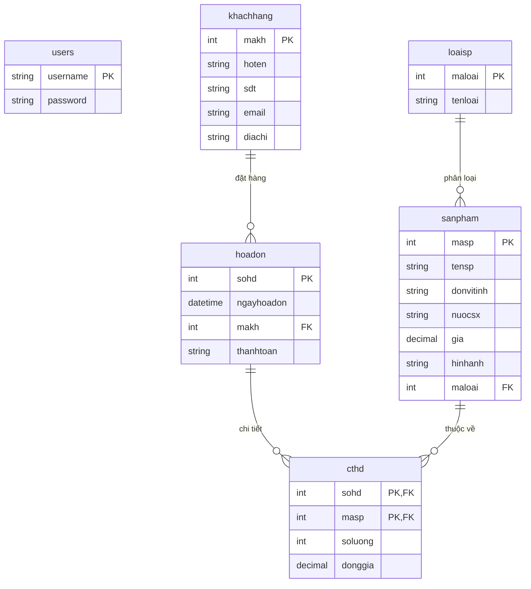

Đây là nội dung file **`database-design.md`** được trình bày theo chuẩn tài liệu kỹ thuật chuyên nghiệp. File này cung cấp cái nhìn tổng quan về cấu trúc dữ liệu, các mối quan hệ (ERD) và các ràng buộc nghiệp vụ quan trọng.

---

## NỘI DUNG FILE: `/docs/database/database-design.md`

# THIẾT KẾ CƠ SỞ DỮ LIỆU (DATABASE DESIGN)

## 1. Sơ đồ quan hệ thực thể (ER Diagram)

Sơ đồ dưới đây mô tả mối quan hệ giữa các bảng trong hệ thống quản lý bán hàng:

---

## 2. Chi tiết các bảng (Data Dictionary)

### 2.1. Bảng `users` (Xác thực)

Lưu trữ thông tin tài khoản đăng nhập hệ thống.

| Column | Data Type | Constraints | Description |
| --- | --- | --- | --- |
| **username** | VARCHAR(50) | **PRIMARY KEY** | Tên đăng nhập duy nhất. |
| **password** | VARCHAR(255) | NOT NULL | Mật khẩu (Yêu cầu đã được mã hóa Hash). |

> **Ghi chú bảo mật:** Độ dài `VARCHAR(255)` được thiết kế để phù hợp với các thuật toán Hash hiện đại như **BCrypt** hoặc **Argon2**.

### 2.2. Bảng `khachhang`

Quản lý thông tin định danh và liên lạc của khách hàng.

| Column | Data Type | Constraints | Description |
| --- | --- | --- | --- |
| **makh** | INT | **PK**, AUTO_INCREMENT | Mã khách hàng tự động tăng. |
| **hoten** | VARCHAR(100) | NOT NULL | Họ và tên khách hàng. |
| **sdt** | VARCHAR(20) |  | Số điện thoại liên lạc. |
| **email** | VARCHAR(100) |  | Địa chỉ Email. |
| **diachi** | VARCHAR(255) |  | Địa chỉ cư trú. |

### 2.3. Bảng `loaisp` và `sanpham`

Quản lý danh mục hàng hóa và chi tiết sản phẩm.

**Bảng `loaisp`:**

* `maloai`: Mã loại sản phẩm (PK).
* `tenloai`: Tên danh mục (Ví dụ: Điện tử, Gia dụng).

**Bảng `sanpham`:**

* `gia`: Sử dụng kiểu `DECIMAL(12,2)` để đảm bảo độ chính xác tuyệt đối khi tính toán tiền tệ, tránh sai số của kiểu `FLOAT/DOUBLE`.
* `maloai`: Khóa ngoại liên kết tới `loaisp`. Nếu loại sản phẩm bị xóa, hệ thống sẽ chặn (`RESTRICT`) để đảm bảo toàn vẹn dữ liệu.

### 2.4. Bảng `hoadon` và `cthd` (Giao dịch)

Quản lý thông tin đơn hàng và chi tiết các mặt hàng trong đơn.

**Bảng `cthd` (Chi tiết hóa đơn):**

* Sử dụng **Composite Primary Key** trên cặp `(sohd, masp)` để đảm bảo một sản phẩm không xuất hiện 2 dòng trong cùng một hóa đơn.
* `donggia`: Lưu giá tại thời điểm bán để đối chiếu sau này nếu sản phẩm thay đổi giá trong tương lai.

---

## 3. Các ràng buộc toàn vẹn (Integrity Constraints)

### 3.1. Quy tắc Xóa/Cập nhật (Cascade Policy)

Hệ thống áp dụng các quy tắc sau để bảo vệ dữ liệu:

* **Update CASCADE:** Khi mã khóa chính (ví dụ `makh`) thay đổi, tất cả các bản ghi liên quan ở khóa ngoại sẽ tự động cập nhật theo.
* **Delete RESTRICT:** Không cho phép xóa Khách hàng hoặc Sản phẩm nếu đã có dữ liệu hóa đơn liên quan.
* **Delete CASCADE (chỉ cho `cthd`):** Khi xóa một hóa đơn (`hoadon`), toàn bộ chi tiết (`cthd`) của hóa đơn đó sẽ tự động bị xóa bỏ.

### 3.2. Hiệu năng (Performance)

* Các cột khóa chính và khóa ngoại đã được tự động tạo Index để tăng tốc độ truy vấn `JOIN`.
* Kiểu dữ liệu `VARCHAR` được giới hạn độ dài hợp lý để tối ưu không gian lưu trữ.

---

Bản tài liệu này là cơ sở để bạn triển khai các lớp **Repository (DAO)** trong Java một cách chính xác.

**Bạn đã hoàn thành xong toàn bộ "xương sống" cho dự án (Docs + Database). Bạn có muốn tôi bắt đầu hướng dẫn viết code cho lớp `UserRepository` để xử lý đăng nhập dựa trên schema này không?**
